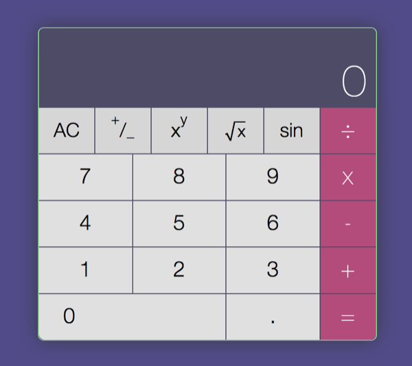

### Go web calculator

> A calculator powered by lexical analysis

### About

The Go Programming Language [textbook][gopl] offers a study of an expression
evaluator. Using lexical analysis, we expose a simple web server that evaluates
mathematical expressions. A web-based calculator is provided as an interface to
the expression evaluator.

### Compile

You will need the latest stable version of go installed on your machine:

https://golang.org/dl/

Run the following command to download and build for execution:

`go get -u github.com/justinpage/go-web-calculator`

### Execute

1. Launch web-based calculator:
	- `go-web-calculator` or `go-web-calculator --port <number>`
2. Visit `localhost:<port-number>`
	- By default, port number is `8080`.

### Credits

- Original design by [Sarah Frisk][sarah]
- Lexical analysis was studied under Donovan and Kernighan via [GOPL][gopl]

[sarah]: https://codepen.io/sfrisk/pen/BymJer
[gopl]: http://www.gopl.io/

